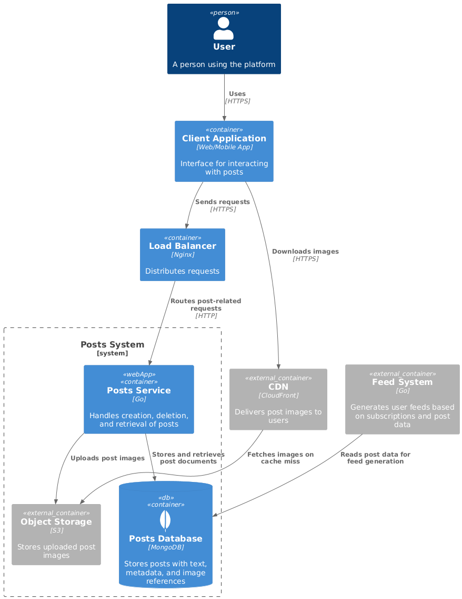
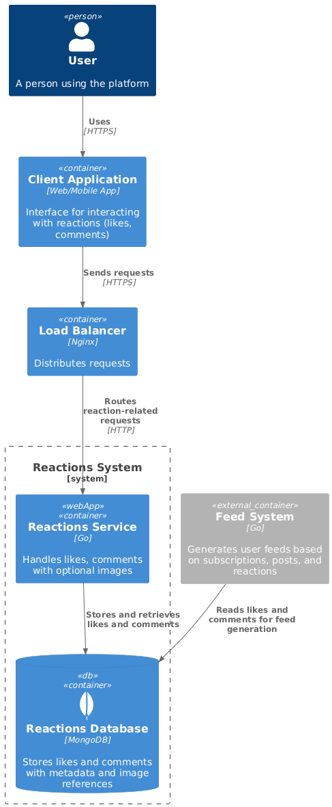
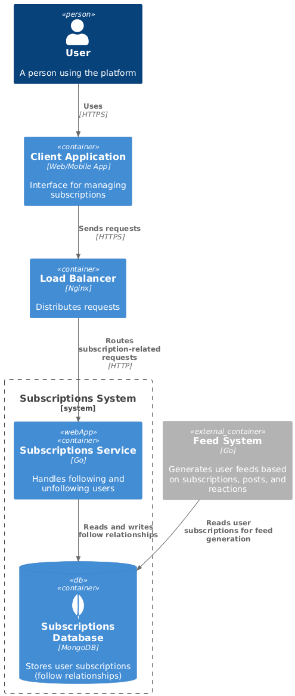
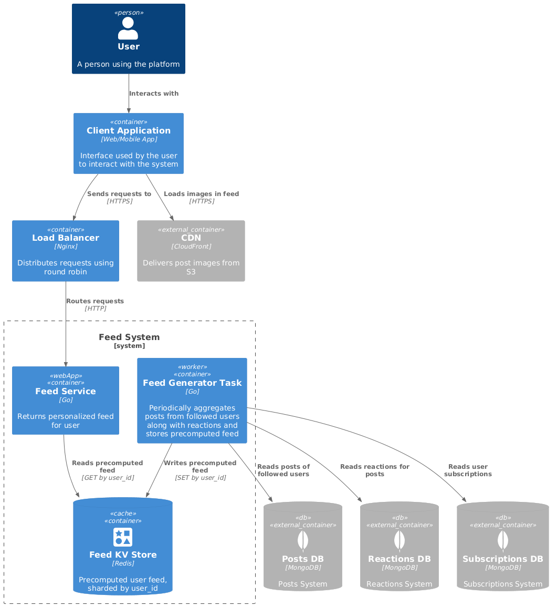

# 📐 System Design Social network для [курса по System Design](https://balun.courses/courses/system_design)

---

## 🧩 Функциональные требования

- Публикация постов (текст + фотографии)
- Указание геолокации вручную
- Лайки к постам
- Комментарии к постам (редактирование и удаление)
- Подписка на других пользователей
- Просмотр списка подписок
- Поиск популярных мест и просмотр постов по местам
- Лента пользователя (по подпискам, обратный хронологический порядок)
- Лента других пользователей (обзор путешествий)

---

## ⚙️ Нефункциональные требования

### 📈 Аудитория и активность

- **DAU**: 10 000 000 пользователей
- **Регион**: страны СНГ
- **Хранение данных**: данные храним всегда

### 👥 Активность пользователей

| Действие                         | Среднее значение в сутки на пользователя | RPS                              |
|----------------------------------|------------------------------------------|----------------------------------|
| Посты                            | 0.5                                      | `10 000 000 × 0.5 / 86400 = 58`  |
| Комментарии                      | 5                                        | `10 000 000 × 5 / 86400 = 579`   |
| Реакции (лайки)                  | 15                                       | `10 000 000 × 15 / 86400 = 1736` |
| Просмотр ленты                   | 5                                        | `10 000 000 × 5 / 86400 = 579`   |
| Просмотр подписок                | 1                                        | `10 000 000 × 1 / 86400 = 116`   |
| Просмотр комментариев под постом | 5                                        | `10 000 000 × 5 / 86400 = 579`   |
| Просмотр постов                  | 5                                        | `10 000 000 × 5 / 86400 = 579`   |

### 🌐 Одновременные соединения

- Примерно 10% от DAU → `10 000 000 × 0.1 = 1 000 000` соединений

### 🧮 Трафик

> Предполагаемые размеры:

- Пост — 600 КБ
- Комментарий — 5 КБ
- Лайк — 1 КБ
- Лента — 500 КБ
- Подписки — 5 КБ

### 📥 Write операции:

| Операция    | RPS  | Медиа (KB) | Мета (KB) | Примерная нагрузка (MB/s) |
|-------------|------|------------|-----------|---------------------------|
| Посты       | 58   | 250        | 50        | ~17.4                     |
| Комментарии | 579  | 0          | 5         | ~2.9                      |
| Лайки       | 1736 | 0          | 1         | ~1.7                      |
| Подписки    | 347  | 0          | 1         | ~0.35                     |

### 📖 Read операции (Чтение)

| Операция    | RPS | Медиа (KB) | Мета (KB) | Общий трафик (MB/s) |
|-------------|-----|------------|-----------|---------------------|
| Лента       | 579 | 2500       | 500       | ~1737               |
| Посты       | 579 | 500        | 100       | ~349                |
| Комментарии | 579 | 0          | 500       | ~290                |
| Подписки    | 116 | 0          | 5         | ~0.6                |

---

## 🧠 Обзор архитектуры

---
Для описания архитектуры системы используется [модель C4](https://c4model.com/).
Модель C4 была создана для того, чтобы помочь командам разработки программного обеспечения **ясно и наглядно описывать архитектуру системы** — как на этапе проектирования, так и при документировании существующего кода.

     <b>Level 1.</b> System context diagram  

  

     <b>Level 2.</b> Posts system container diagram  

  

     <b>Level 2.</b> Reactions system container diagram  

  

     <b>Level 2.</b> Subscriptions system container diagram  

  

     <b>Level 2.</b> Feed system container diagram  

  

---

## 📖 Оценка ресурсов

### Картинки

> Для хранения изображений будем использовать S3.

**Capacity**:  
`14.5 MB/s × 86 400 × 365 ≈ 457 TB`

**HDD-диски:**

- Требуемый IOPS: `58 + 579 + 579 = 1216`
- Дисков по ёмкости: `457 TB / 2 TB = 228.5`
- Дисков по пропускной способности: `(14.5 + 289.5 + 1447.5) MB/s / 100 MB/s = 17.5`
- Дисков по IOPS: `1216 / 100 = 12.2`
- **Итого**: `229 HDD-дисков по 2 ТБ`

**SSD-диски (SATA):**

- Дисков по ёмкости: `457 TB / 5 TB = 91.4`
- Дисков по пропускной способности: `(14.5 + 289.5 + 1447.5) MB/s / 500 MB/s = 3.5`
- Дисков по IOPS: `1216 / 1000 = 1.2`
- **Итого**: `92 SSD-диска по 5 ТБ`

**Будем охлаждать 80% на HDD, используя поколения**

**SSD- 91.4 ТБ**

- Дисков по ёмкости: `91.4 TB / 5 TB = 19`
- Дисков по пропускной способности: `350 MB/s / 500 MB/s = 1`
- Дисков по IOPS: `1000 / 1000 = 1`
- **Итого**: `19 SSD-диска по 5 ТБ`

**HDD - 365.6 ТБ**

- Дисков по ёмкости: `365.6 TB / 20 TB = 19`
- Дисков по пропускной способности: `1400 MB/s / 100 MB/s = 14`
- Дисков по IOPS: `1000 / 100 = 10`
- **Итого**: `19 HDD-диска по 5 ТБ`

✅ Выбор: **19 SSD(SATA) дисков по 5 ТБ и 19 HHD дисков по 20 ТБ**

### 🧠 Архитектура хранения

- **Хранилище:** S3
- **Тип шардирования:** `object-level sharding` (распределение по узлам с помощью хеширования ключей)
- **Тип репликации:** `async peer-to-peer`
- **Фактор репликации (RF):** `2`
- Всего дисков = 19 (HDD) + 19 (SSD) = 38
- Дисков на хост = 2
- Фактор репликации = 2 (две копии)
- Хостов без учёта репликации: 38 / 2 = 19
- Хостов с учётом репликации: 19 × 2 = 38
---

### Посты (мета)

**Capacity**:  
`2.9 MB/s × 86 400 × 365 ≈ 92.5 TB`

**SSD-диски (SATA):**

- Требуемый IOPS: `1216`
- Дисков по ёмкости: `92.5 TB / 5 TB = 18.5`
- Дисков по пропускной способности: `(2.9 + 57.9 + 289.5) MB/s / 500 MB/s = 0.7`
- Дисков по IOPS: `1216 / 1000 = 1.2`
- **Итого**: `19 SSD-дисков по 5 ТБ`

✅ Выбор: **19 SSD(SATA) дисков по 5 ТБ**

### 🧠 Архитектура хранения

- **СУБД:** MongoDB
- **Тип шардирования:** `sharding по user_id`
- **Тип репликации:** `async master-slave`
- **Фактор репликации (RF):** `2`
- Всего дисков = 19
- Дисков на хост = 2
- Фактор репликации = 2 (две копии)
- Хостов без учёта репликации: 19 / 2 = 10
- Хостов с учётом репликации: 10 × 2 = 20
- Общее количество шардов с учётом репликации: 10 × 2 = 20
---

### Комментарии

**Capacity**:  
`2.9 MB/s × 86 400 × 365 ≈ 9 TB`

**HDD-диски:**

- Требуемый IOPS: `579 + 579 = 1158`
- Дисков по ёмкости: `9 TB / 2 TB = 5`
- Дисков по пропускной способности: `(2.9 + 290) MB/s / 100 MB/s = 3`
- Дисков по IOPS: `1158 / 100 = 11.6`
- **Итого**: `12 HDD-дисков по 2 ТБ`

**SSD-диски (SATA):**

- Требуемый IOPS: `1158`
- Дисков по ёмкости: `9 TB / 2 TB = 5`
- Дисков по пропускной способности: `(2.9 + 290) MB/s / 500 MB/s = 1`
- Дисков по IOPS: `1158 / 1000 = 1.2`
- **Итого**: `5 SSD-дисков по 2 ТБ`

✅ Выбор: **5 HDD-диска по 2 ТБ**

### 🧠 Архитектура хранения

- **СУБД:** MongoDB
- **Тип шардирования:** `sharding по post_id`
- **Тип репликации:** `async master-slave`
- **Фактор репликации (RF):** `2`
- Всего дисков = 5
- Дисков на хост = 2
- Фактор репликации = 2 (две копии)
- Хостов без учёта репликации: 5 / 2 = 3
- Хостов с учётом репликации: 3 × 2 = 6
- Общее количество шардов с учётом репликации: 3 × 2 = 6
---

### Лайки

**Capacity**:  
`1.7 MB/s × 86 400 × 365 ≈ 5 TB`

**HDD-диски:**

- Требуемый IOPS: `1736`
- Дисков по ёмкости: `5 TB / 2 TB = 2.5`
- Дисков по пропускной способности: `1.7 MB/s / 100 MB/s = 0.017`
- Дисков по IOPS: `1736 / 100 = 17.4`
- **Итого**: `18 HDD-дисков по 2 ТБ`

**SSD-диски (SATA):**

- Требуемый IOPS: `1736`
- Дисков по ёмкости: `5 TB / 2 TB = 3`
- Дисков по пропускной способности: `1.7 MB/s / 500 MB/s = 0.7`
- Дисков по IOPS: `1736 / 1000 = 2`
- **Итого**: `3 SSD-диска по 2 ТБ`

✅ Выбор: **3 SSD диска по 2 ТБ**

### 🧠 Архитектура хранения

- **СУБД:** MongoDB
- **Тип шардирования:** `sharding по post_id`
- **Тип репликации:** `async master-slave`
- **Фактор репликации (RF):** `2`
- Всего дисков = 3
- Дисков на хост = 2
- Фактор репликации = 2 (две копии)
- Хостов без учёта репликации: 3 / 2 = 2
- Хостов с учётом репликации: 2 × 2 = 4
- Общее количество шардов с учётом репликации: 2 × 2 = 4
---

### Подписки

**Capacity**:  
`0.35 MB/s × 86 400 × 365 ≈ 1.1 TB`

**HDD-диски:**

- Требуемый IOPS: `463`
- Дисков по ёмкости: `1.1 TB / 2 TB = 0.6`
- Дисков по пропускной способности: `(0.6 + 0.35) MB/s / 100 MB/s = 0.01`
- Дисков по IOPS: `463 / 100 = 4.7`
- **Итого**: `5 HDD-дисков по 2 ТБ`

✅ Выбор: **5 HDD-диска по 2 ТБ**

### 🧠 Архитектура хранения

- **СУБД:** MongoDB
- **Тип шардирования:** `sharding по user_id`
- **Тип репликации:** `async master-slave`
- **Фактор репликации (RF):** `2`
- Всего дисков = 5
- Дисков на хост = 2
- Фактор репликации = 2 (две копии)
- Хостов без учёта репликации: 5 / 2 = 3
- Хостов с учётом репликации: 3 × 2 = 6
- Общее количество шардов с учётом репликации: 3 × 2 = 6
---

### Пользователи

**Capacity**: 
Примерный расчет на год:
`80 000 000 * 150 B ≈ 12 GB`

**HDD-диски:**

- Дисков по ёмкости: `12 GB / 6 GB = 2`

✅ Выбор: **2 HHD диска по 6 GB**

### 🧠 Архитектура хранения

- **СУБД:** PostgreSQL
- **Тип репликации:** `sync master-slave`
- **Фактор репликации (RF):** `2`
- Всего дисков = 2
- Дисков на хост = 2
- Фактор репликации = 2 (две копии)
- Хостов без учёта репликации: 1
- Хостов с учётом репликации: 2
---

### ⏱ Временные ограничения

| Операция         | Максимальное время ответа |
|------------------|---------------------------|
| Публикация поста | ≤ 1.5 секунды             |
| Лайк             | ≤ 1 секунда               |
| Комментарий      | ≤ 1 секунд                |
| Лента            | ≤ 1 секунда               |

---

### 🛡 Доступность

- 99.99%

---

### 🔒 Лимиты

- Максимум подписок у одного пользователя: **1 000 000**
